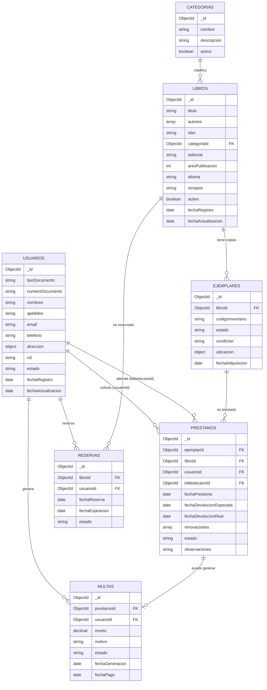

# Modelamiento de la base de datos — MongoDB

Base de datos: `bmvll_db`

## Decisiones de diseño (por qué es escalable)

1. **Catálogo separado de inventario físico**: `libros` guarda solo metadata (título, autor, categoría). Cada copia física es un `ejemplares` independiente con su propio código de inventario y estado. Así se puede rastrear pérdida/daño/reparación por copia, no solo un contador — y agregar más copias de un mismo libro no toca el documento del libro.
2. **Roles en el usuario desde el inicio**: `usuarios.rol` (`ADMIN`, `BIBLIOTECARIO`, `SOCIO`) evita tener que migrar el esquema cuando se agregue login/autenticación.
3. **Catálogo de categorías normalizado**: `categorias` es su propia colección (administrable) en vez de un string libre en cada libro — evita inconsistencias ("Novela" vs "novela" vs "Novelas").
4. **Trazabilidad**: `prestamos` referencia también al `bibliotecarioId` que lo atendió (accountability) y guarda historial de `renovaciones`.
5. **Extensiones ya contempladas en el esquema**: `multas` (atrasos/daños) y `reservas` (libro sin ejemplares disponibles) — no requieren rediseñar `prestamos` cuando se implementen.
6. **Auditoría uniforme**: todas las colecciones tienen `fechaRegistro`/`fechaActualizacion`, y las de catálogo tienen `activo` (soft delete) en vez de borrado físico.

## Diagrama de relaciones

---

## Colección `usuarios`

| Campo               | Tipo     | Requerido | Notas                                                       |
|---------------------|----------|-----------|--------------------------------------------------------------|
| `_id`                | ObjectId | auto      |                                                                |
| `tipoDocumento`      | string   | sí        | enum: `DNI`, `CE`, `PASAPORTE`                                |
| `numeroDocumento`    | string   | sí        | único junto con `tipoDocumento`                               |
| `nombres`            | string   | sí        |                                                                |
| `apellidos`          | string   | sí        |                                                                |
| `email`              | string   | sí        | único                                                         |
| `telefono`           | string   | no        |                                                                |
| `direccion`          | object   | no        | `{ direccion, distrito, referencia }`                         |
| `rol`                | string   | sí        | enum: `ADMIN`, `BIBLIOTECARIO`, `SOCIO` — default `SOCIO`     |
| `estado`             | string   | sí        | enum: `ACTIVO`, `SUSPENDIDO`, `INACTIVO` — default `ACTIVO`   |
| `passwordHash`       | string   | no        | reservado para cuando se agregue login (fuera de esta fase)   |
| `fechaRegistro`      | date     | sí        |                                                                |
| `fechaActualizacion` | date     | no        |                                                                |

**Índices:** `{tipoDocumento, numeroDocumento}` único, `email` único, `rol`.

## Colección `categorias`

| Campo         | Tipo    | Requerido | Notas          |
|---------------|---------|-----------|-----------------|
| `_id`         | ObjectId| auto      |                 |
| `nombre`      | string  | sí        | único           |
| `descripcion` | string  | no        |                 |
| `activo`      | bool    | sí        | default `true`  |

**Índices:** `nombre` único.

## Colección `libros` (catálogo — metadata, sin conteo de ejemplares)

| Campo                | Tipo     | Requerido | Notas                                       |
|----------------------|----------|-----------|-----------------------------------------------|
| `_id`                | ObjectId | auto      |                                                |
| `titulo`             | string   | sí        |                                                |
| `autores`            | array    | sí        | array de strings, permite varios autores      |
| `isbn`               | string   | sí        | único                                          |
| `categoriaId`        | ObjectId | sí        | referencia a `categorias._id`                 |
| `editorial`          | string   | no        |                                                |
| `anioPublicacion`    | int      | no        |                                                |
| `idioma`             | string   | no        |                                                |
| `sinopsis`           | string   | no        |                                                |
| `activo`             | bool     | sí        | soft delete, default `true`                   |
| `fechaRegistro`      | date     | sí        |                                                |
| `fechaActualizacion` | date     | no        |                                                |

**Disponibilidad ya NO es un campo del libro**: se calcula contando `ejemplares` con `estado = DISPONIBLE` para ese `libroId`. Esto resuelve el problema original (visibilidad de disponibilidad) sin arriesgar que el contador se desincronice del inventario real.

**Índices:** `isbn` único, texto en `titulo` + `autores`, `categoriaId`.

## Colección `ejemplares` (inventario físico — 1 documento por copia)

| Campo              | Tipo     | Requerido | Notas                                                                 |
|--------------------|----------|-----------|-------------------------------------------------------------------------|
| `_id`              | ObjectId | auto      |                                                                           |
| `libroId`          | ObjectId | sí        | referencia a `libros._id`                                                |
| `codigoInventario` | string   | sí        | único (código físico/etiqueta del ejemplar)                             |
| `estado`           | string   | sí        | enum: `DISPONIBLE`, `PRESTADO`, `RESERVADO`, `EN_REPARACION`, `PERDIDO`, `DE_BAJA` |
| `condicion`        | string   | no        | enum: `NUEVO`, `BUENO`, `REGULAR`, `DETERIORADO`                        |
| `ubicacion`        | object   | no        | `{ sede, estante }` — ya soporta múltiples sedes a futuro               |
| `fechaAdquisicion` | date     | no        |                                                                           |

**Índices:** `codigoInventario` único, `libroId`, `{libroId, estado}` (para contar disponibilidad rápido), `estado`.

## Colección `prestamos`

| Campo                     | Tipo     | Requerido | Notas                                                              |
|---------------------------|----------|-----------|-----------------------------------------------------------------------|
| `_id`                     | ObjectId | auto      |                                                                         |
| `ejemplarId`              | ObjectId | sí        | referencia a `ejemplares._id` (la copia física exacta prestada)       |
| `libroId`                 | ObjectId | sí        | denormalizado desde el ejemplar, para listar/filtrar sin join extra   |
| `usuarioId`               | ObjectId | sí        | referencia al socio que se lleva el libro                             |
| `bibliotecarioId`         | ObjectId | sí        | referencia al usuario (rol `BIBLIOTECARIO`/`ADMIN`) que lo registró   |
| `fechaPrestamo`           | date     | sí        |                                                                         |
| `fechaDevolucionEsperada` | date     | sí        | el campo que faltaba en el cuaderno físico                            |
| `fechaDevolucionReal`     | date     | no        | `null` mientras esté activo                                           |
| `renovaciones`            | array    | no        | `[{ fecha, nuevaFechaDevolucionEsperada }]` — historial de renovaciones |
| `estado`                  | string   | sí        | enum: `ACTIVO`, `DEVUELTO`, `ATRASADO`, `PERDIDO`                     |
| `observaciones`           | string   | no        |                                                                         |

**Índices:** `usuarioId`, `ejemplarId`, `estado`, `{usuarioId, estado}` (saber al instante si un socio tiene préstamos pendientes).

## Colección `multas` (atrasos / daños — extensión ya contemplada)

| Campo             | Tipo     | Requerido | Notas                                          |
|-------------------|----------|-----------|---------------------------------------------------|
| `_id`             | ObjectId | auto      |                                                     |
| `prestamoId`      | ObjectId | sí        | referencia a `prestamos._id`                       |
| `usuarioId`       | ObjectId | sí        | denormalizado para consultar multas por socio      |
| `monto`           | decimal  | sí        |                                                     |
| `motivo`          | string   | sí        | enum: `ATRASO`, `PERDIDA`, `DANIO`                 |
| `estado`          | string   | sí        | enum: `PENDIENTE`, `PAGADO`, `CONDONADO`           |
| `fechaGeneracion` | date     | sí        |                                                     |
| `fechaPago`       | date     | no        |                                                     |

**Índices:** `usuarioId`, `{usuarioId, estado}`, `prestamoId`.

## Colección `reservas` (libro sin ejemplares disponibles — extensión ya contemplada)

| Campo             | Tipo     | Requerido | Notas                                                          |
|-------------------|----------|-----------|-------------------------------------------------------------------|
| `_id`             | ObjectId | auto      |                                                                     |
| `libroId`         | ObjectId | sí        | referencia a `libros._id`                                          |
| `usuarioId`       | ObjectId | sí        | referencia a `usuarios._id`                                        |
| `fechaReserva`    | date     | sí        |                                                                     |
| `fechaExpiracion` | date     | sí        | si nadie la reclama antes de esta fecha, pasa a `EXPIRADA`         |
| `estado`          | string   | sí        | enum: `PENDIENTE`, `NOTIFICADA`, `CONVERTIDA`, `CANCELADA`, `EXPIRADA` |

**Índices:** `{libroId, estado}`, `usuarioId`.

---

## Reglas de negocio (a implementar en el servicio, no en la BD)

1. **Registrar préstamo**: buscar un `ejemplar` con `libroId` dado y `estado = DISPONIBLE` → marcarlo `PRESTADO` → crear `prestamo` (`estado = ACTIVO`) con `ejemplarId` + `libroId` denormalizado.
2. **Registrar devolución**: ubicar el `prestamo` activo → `fechaDevolucionReal = now`, `estado = DEVUELTO` → el `ejemplar` vuelve a `DISPONIBLE` (o `EN_REPARACION`/`PERDIDO` según condición al devolver).
3. **Disponibilidad de un libro** = `count(ejemplares donde libroId = X y estado = DISPONIBLE) > 0`.
4. **Estado `ATRASADO`**: se calcula cuando `estado = ACTIVO` y `fechaDevolucionEsperada < hoy`. En esta fase se calcula al leer (query); un job programado que lo persista y genere `multas` automáticamente queda para una fase posterior.
5. **Reserva** (fase posterior): si no hay ejemplares `DISPONIBLE`, el socio puede crear una `reserva`; al devolverse un ejemplar, se prioriza la reserva más antigua antes de dejarlo `DISPONIBLE` para el público general.
6. **Historial por usuario**: `db.prestamos.find({ usuarioId })` ordenado por `fechaPrestamo`.
