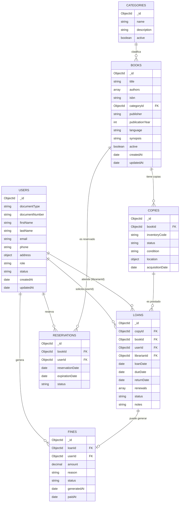

# Modelamiento de la base de datos — MongoDB

Base de datos: `bmvll_db`

> Convención: nombres de colecciones, campos y valores de enum en **inglés** (para alinear con el código Java). La prosa/documentación de este archivo se mantiene en español.

## Decisiones de diseño (por qué es escalable)

1. **Catálogo separado de inventario físico**: `books` guarda solo metadata (título, autor, categoría). Cada copia física es un `copies` independiente con su propio código de inventario y estado. Así se puede rastrear pérdida/daño/reparación por copia, no solo un contador — y agregar más copias de un mismo libro no toca el documento del libro.
2. **Roles en el usuario desde el inicio**: `users.role` (`ADMIN`, `LIBRARIAN`, `MEMBER`) evita tener que migrar el esquema cuando se agregue login/autenticación. Staff (`ADMIN`/`LIBRARIAN`) y socios (`MEMBER`) comparten la misma colección — no hay una colección separada para personal.
3. **Catálogo de categorías normalizado**: `categories` es su propia colección (administrable) en vez de un string libre en cada libro — evita inconsistencias ("Novela" vs "novela" vs "Novelas").
4. **Trazabilidad**: `loans` referencia también al `librarianId` que lo atendió (accountability) y guarda historial de `renewals`.
5. **Extensiones ya contempladas en el esquema**: `fines` (atrasos/daños) y `reservations` (libro sin ejemplares disponibles) — no requieren rediseñar `loans` cuando se implementen.
6. **Auditoría uniforme**: todas las colecciones tienen `createdAt`/`updatedAt`, y las de catálogo tienen `active` (soft delete) en vez de borrado físico.

## Diagrama de relaciones

---

## Colección `users`

| Campo               | Tipo     | Requerido | Notas                                                       |
|---------------------|----------|-----------|----------------------------------------------------------------|
| `_id`                | ObjectId | auto      |                                                                |
| `documentType`      | string   | sí        | enum: `DNI`, `CE`, `PASSPORT`                                 |
| `documentNumber`    | string   | sí        | único junto con `documentType`                                |
| `firstName`         | string   | sí        |                                                                |
| `lastName`          | string   | sí        |                                                                |
| `email`              | string   | sí        | único                                                         |
| `phone`             | string   | no        |                                                                |
| `address`           | object   | no        | `{ street, district, reference }`                              |
| `role`               | string   | sí        | enum: `ADMIN`, `LIBRARIAN`, `MEMBER` — default `MEMBER`       |
| `status`             | string   | sí        | enum: `ACTIVE`, `SUSPENDED`, `INACTIVE` — default `ACTIVE`    |
| `passwordHash`       | string   | no        | reservado para cuando se agregue login (fuera de esta fase)   |
| `createdAt`          | date     | sí        |                                                                |
| `updatedAt`          | date     | no        |                                                                |

**Índices:** `{documentType, documentNumber}` único, `email` único, `role`.

## Colección `categories`

| Campo         | Tipo    | Requerido | Notas          |
|---------------|---------|-----------|-----------------|
| `_id`         | ObjectId| auto      |                 |
| `name`        | string  | sí        | único           |
| `description` | string  | no        |                 |
| `active`      | bool    | sí        | default `true`  |

**Índices:** `name` único.

## Colección `books` (catálogo — metadata, sin conteo de ejemplares)

| Campo                | Tipo     | Requerido | Notas                                       |
|----------------------|----------|-----------|-----------------------------------------------|
| `_id`                | ObjectId | auto      |                                                |
| `title`              | string   | sí        |                                                |
| `authors`            | array    | sí        | array de strings, permite varios autores      |
| `isbn`               | string   | sí        | único                                          |
| `categoryId`         | ObjectId | sí        | referencia a `categories._id`                 |
| `publisher`          | string   | no        |                                                |
| `publicationYear`    | int      | no        |                                                |
| `language`           | string   | no        |                                                |
| `synopsis`           | string   | no        |                                                |
| `active`             | bool     | sí        | soft delete, default `true`                   |
| `createdAt`          | date     | sí        |                                                |
| `updatedAt`          | date     | no        |                                                |

**Disponibilidad ya NO es un campo del libro**: se calcula contando `copies` con `status = AVAILABLE` para ese `bookId`. Esto resuelve el problema original (visibilidad de disponibilidad) sin arriesgar que el contador se desincronice del inventario real.

**Índices:** `isbn` único, texto en `title` + `authors`, `categoryId`.

## Colección `copies` (inventario físico — 1 documento por copia)

| Campo              | Tipo     | Requerido | Notas                                                                 |
|--------------------|----------|-----------|-------------------------------------------------------------------------|
| `_id`              | ObjectId | auto      |                                                                           |
| `bookId`           | ObjectId | sí        | referencia a `books._id`                                                 |
| `inventoryCode`    | string   | sí        | único (código físico/etiqueta del ejemplar)                             |
| `status`           | string   | sí        | enum: `AVAILABLE`, `LOANED`, `RESERVED`, `IN_REPAIR`, `LOST`, `WITHDRAWN` |
| `condition`        | string   | no        | enum: `NEW`, `GOOD`, `FAIR`, `DAMAGED`                                   |
| `location`         | object   | no        | `{ branch, shelf }` — ya soporta múltiples sedes a futuro                |
| `acquisitionDate`  | date     | no        |                                                                           |

**Índices:** `inventoryCode` único, `bookId`, `{bookId, status}` (para contar disponibilidad rápido), `status`.

## Colección `loans`

| Campo                     | Tipo     | Requerido | Notas                                                              |
|---------------------------|----------|-----------|-----------------------------------------------------------------------|
| `_id`                     | ObjectId | auto      |                                                                         |
| `copyId`                  | ObjectId | sí        | referencia a `copies._id` (la copia física exacta prestada)           |
| `bookId`                  | ObjectId | sí        | denormalizado desde el ejemplar, para listar/filtrar sin join extra   |
| `userId`                  | ObjectId | sí        | referencia al socio que se lleva el libro                             |
| `librarianId`             | ObjectId | sí        | referencia al usuario (rol `LIBRARIAN`/`ADMIN`) que lo registró       |
| `loanDate`                | date     | sí        |                                                                         |
| `dueDate`                 | date     | sí        | el campo que faltaba en el cuaderno físico                            |
| `returnDate`              | date     | no        | `null` mientras esté activo                                           |
| `renewals`                | array    | no        | `[{ date, newDueDate }]` — historial de renovaciones                   |
| `status`                  | string   | sí        | enum: `ACTIVE`, `RETURNED`, `OVERDUE`, `LOST`                         |
| `notes`                   | string   | no        |                                                                         |

**Índices:** `userId`, `copyId`, `status`, `{userId, status}` (saber al instante si un socio tiene préstamos pendientes).

## Colección `fines` (atrasos / daños — extensión ya contemplada)

| Campo             | Tipo     | Requerido | Notas                                          |
|-------------------|----------|-----------|-----------------------------------------------------|
| `_id`             | ObjectId | auto      |                                                     |
| `loanId`          | ObjectId | sí        | referencia a `loans._id`                            |
| `userId`          | ObjectId | sí        | denormalizado para consultar multas por socio      |
| `amount`          | decimal  | sí        |                                                     |
| `reason`          | string   | sí        | enum: `LATE_RETURN`, `LOST`, `DAMAGE`              |
| `status`          | string   | sí        | enum: `PENDING`, `PAID`, `WAIVED`                  |
| `generatedAt`     | date     | sí        |                                                     |
| `paidAt`          | date     | no        |                                                     |

**Índices:** `userId`, `{userId, status}`, `loanId`.

## Colección `reservations` (libro sin ejemplares disponibles — extensión ya contemplada)

| Campo             | Tipo     | Requerido | Notas                                                          |
|-------------------|----------|-----------|---------------------------------------------------------------------|
| `_id`             | ObjectId | auto      |                                                                     |
| `bookId`          | ObjectId | sí        | referencia a `books._id`                                           |
| `userId`          | ObjectId | sí        | referencia a `users._id`                                           |
| `reservationDate` | date     | sí        |                                                                     |
| `expirationDate`  | date     | sí        | si nadie la reclama antes de esta fecha, pasa a `EXPIRED`          |
| `status`          | string   | sí        | enum: `PENDING`, `NOTIFIED`, `CONVERTED`, `CANCELLED`, `EXPIRED`   |

**Índices:** `{bookId, status}`, `userId`.

---

## Reglas de negocio (a implementar en el servicio, no en la BD)

1. **Registrar préstamo**: buscar un `copy` con `bookId` dado y `status = AVAILABLE` → marcarlo `LOANED` → crear `loan` (`status = ACTIVE`) con `copyId` + `bookId` denormalizado.
2. **Registrar devolución**: ubicar el `loan` activo → `returnDate = now`, `status = RETURNED` → la `copy` vuelve a `AVAILABLE` (o `IN_REPAIR`/`LOST` según condición al devolver).
3. **Disponibilidad de un libro** = `count(copies donde bookId = X y status = AVAILABLE) > 0`.
4. **Estado `OVERDUE`**: se calcula cuando `status = ACTIVE` y `dueDate < hoy`. En esta fase se calcula al leer (query); un job programado que lo persista y genere `fines` automáticamente queda para una fase posterior.
5. **Reserva** (fase posterior): si no hay copies `AVAILABLE`, el socio puede crear una `reservation`; al devolverse una copia, se prioriza la reserva más antigua antes de dejarla `AVAILABLE` para el público general.
6. **Historial por usuario**: `db.loans.find({ userId })` ordenado por `loanDate`.
